# DragAOC
All files related to advent of code projects.

## Advent of code Information

<https://adventofcode.com/about>

## Scores
<!-- AOC TILES BEGIN -->
<h1 align="center">
  Advent of Code - 189/534 ⭐
</h1>
<h1 align="center">
  2025 - 22 ⭐ - Rust
</h1>
<a href="aoc-2025/src/day01.rs">
  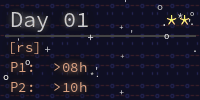
</a>
<a href="aoc-2025/src/day02.rs">
  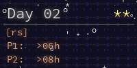
</a>
<a href="aoc-2025/src/day03.rs">
  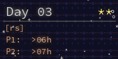
</a>
<a href="aoc-2025/src/day04.rs">
  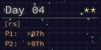
</a>
<a href="aoc-2025/src/day05.rs">
  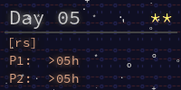
</a>
<a href="aoc-2025/src/day06.rs">
  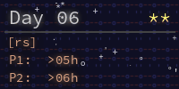
</a>
<a href="aoc-2025/src/day07.rs">
  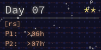
</a>

<a href="aoc-2025/src/day09.rs">
  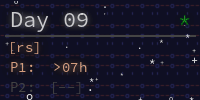
</a>
<a href="aoc-2025/src/day10.rs">
  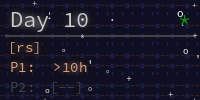
</a>
<a href="aoc-2025/src/day11.rs">
  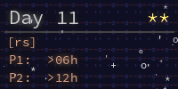
</a>
<a href="aoc-2025/src/day12.rs">
  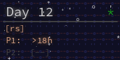
</a>
<h1 align="center">
  2024 - 50 ⭐ - Rust
</h1>
<a href="aoc-2024/src/day01.rs">
  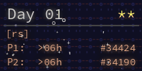
</a>
<a href="aoc-2024/src/day02.rs">
  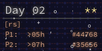
</a>
<a href="aoc-2024/src/day03.rs">
  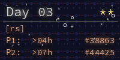
</a>
<a href="aoc-2024/src/day04.rs">
  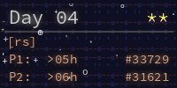
</a>
<a href="aoc-2024/src/day05.rs">
  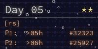
</a>
<a href="aoc-2024/src/day06.rs">
  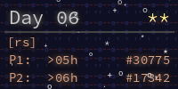
</a>
<a href="aoc-2024/src/day07.rs">
  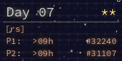
</a>
<a href="aoc-2024/src/day08.rs">
  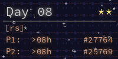
</a>

<a href="aoc-2024/src/day11.rs">
  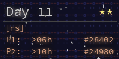
</a>
<a href="aoc-2024/src/day12.rs">
  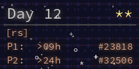
</a>
<a href="aoc-2024/src/day13.rs">
  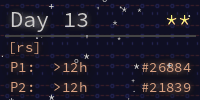
</a>
<a href="aoc-2024/src/day14.rs">
  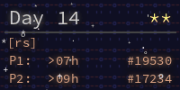
</a>
<a href="aoc-2024/src/day15.rs">
  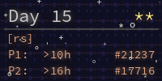
</a>
<a href="aoc-2024/src/day16.rs">
  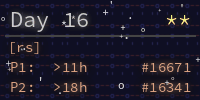
</a>
<a href="aoc-2024/src/day17.rs">
  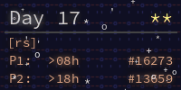
</a>
<a href="aoc-2024/src/day18.rs">
  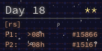
</a>
<a href="aoc-2024/src/day19.rs">
  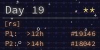
</a>
<a href="aoc-2024/src/day20.rs">
  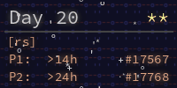
</a>
<a href="aoc-2024/src/day21.rs">
  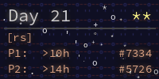
</a>
<a href="aoc-2024/src/day22.rs">
  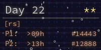
</a>
<a href="aoc-2024/src/day23.rs">
  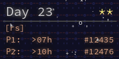
</a>
<a href="aoc-2024/src/day24.rs">
  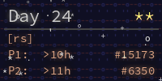
</a>
<a href="aoc-2024/src/day25.rs">
  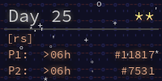
</a>
<h1 align="center">
  2023 - 32 ⭐ - Python
</h1>
<a href="2023/1/helper.py">
  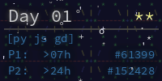
</a>
<a href="2023/2/helper.py">
  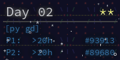
</a>
<a href="2023/3/helper.py">
  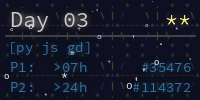
</a>
<a href="2023/4/helper.py">
  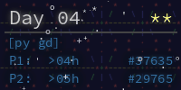
</a>
<a href="2023/5/helper.py">
  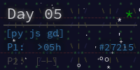
</a>
<a href="2023/6/helper.py">
  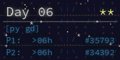
</a>
<a href="2023/7/helper.py">
  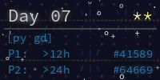
</a>
<a href="2023/8/helper.py">
  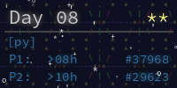
</a>
<a href="2023/9/helper.py">
  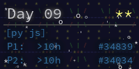
</a>
<a href="2023/10/helper.py">
  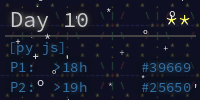
</a>
<a href="2023/11/helper.py">
  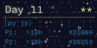
</a>
<a href="2023/12/helper.py">
  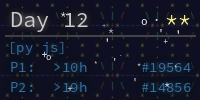
</a>
<a href="2023/13/helper.py">
  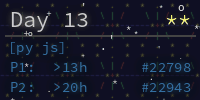
</a>
<a href="2023/14/helper.py">
  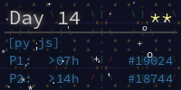
</a>
<a href="2023/15/helper.py">
  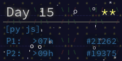
</a>
<a href="2023/16/helper.py">
  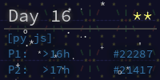
</a>

<h1 align="center">
  2022 - 22 ⭐ - Python
</h1>

<h1 align="center">
  2021 - 18 ⭐ - Python
</h1>

<h1 align="center">
  2019 - 8 ⭐ - Verilog
</h1>

<h1 align="center">
  2015 - 37 ⭐ - Rust
</h1>

<!-- AOC TILES END -->

## Notice about input files
Am i putting this right at the bottom of the file? yes.

Anyway, this repo does contain my input files for **SOME** years, not all but some. This is due to my lazyness when commit files. I have tried to remove said input files, but each solution i try always ends up in having to redownload the repo. I apparently don't know enough git to get it to work.

Henceforth, Those input files will be forever in this repo unless i recieve help to remove this (and this message will also go away). On another note, some of the input files aren't named conventionaly so, enjoy.
