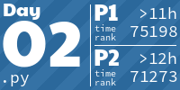

# DragAOC

 My files from advent of code.

## NOTES

- These files contain MY solutions to the day puzzel, you are free to use them. (please give credit though)
- These files will only be uploaded after the leaderboard is filled. (Which is normally when i do the challenge due to timezones)
- I will not be accepting pull requests, This is just a place for me to document my code

- Files named `Data.txt` are not included because they contain data that is locked behind auth on the website. If you want to access it, go to the representive day on the website.

## Advent of code Information

<https://adventofcode.com/about>

## Scores
<!-- AOC TILES BEGIN -->
<h1 align="center">
  Advent of Code - 116/492 ⭐
</h1>
<h1 align="center">
  2024 - 41 ⭐ - Rust
</h1>

<h1 align="center">
  2023 - 32 ⭐ - Python
</h1>

<h1 align="center">
  2022 - 22 ⭐ - Python
</h1>

<h1 align="center">
  2021 - 18 ⭐ - Python
</h1>

<h1 align="center">
  2019 - 2 ⭐ - Rust
</h1>

<h1 align="center">
  2015 - 1 ⭐ - JavaScript
</h1>

<!-- AOC TILES END -->
